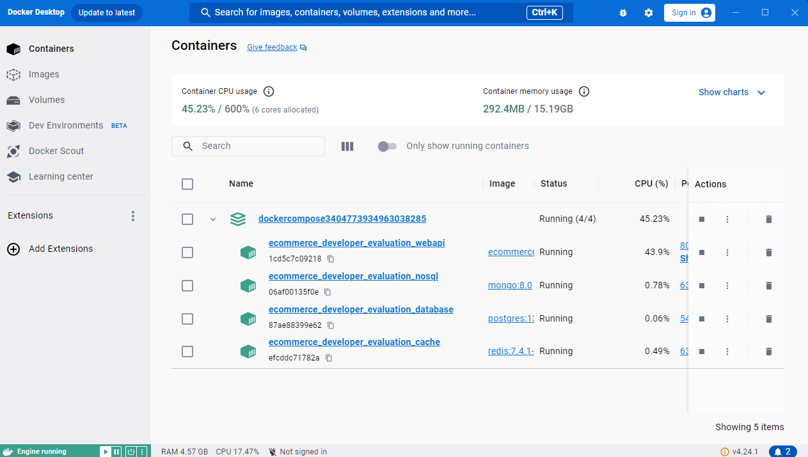
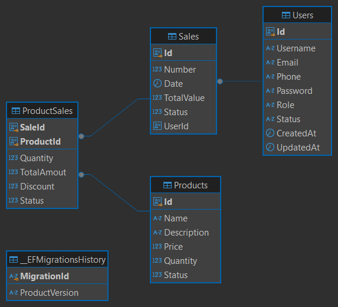
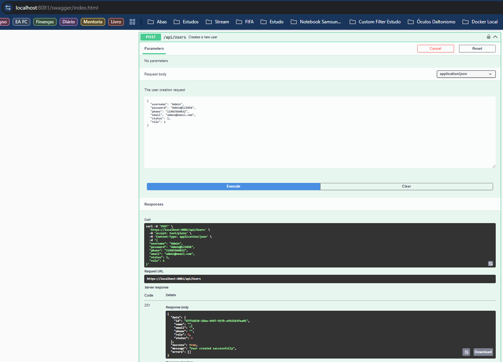
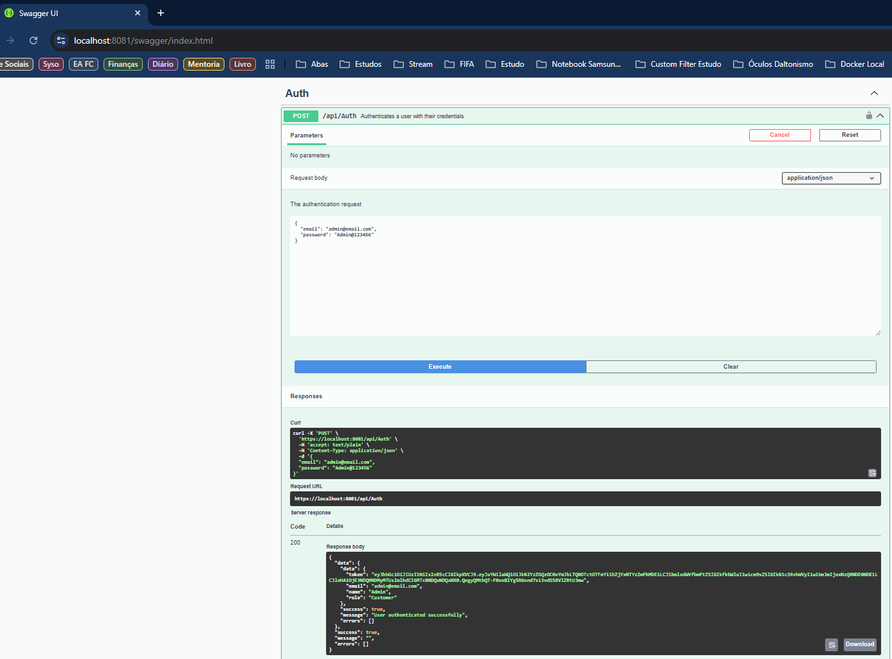
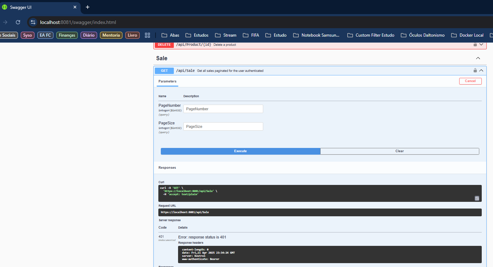
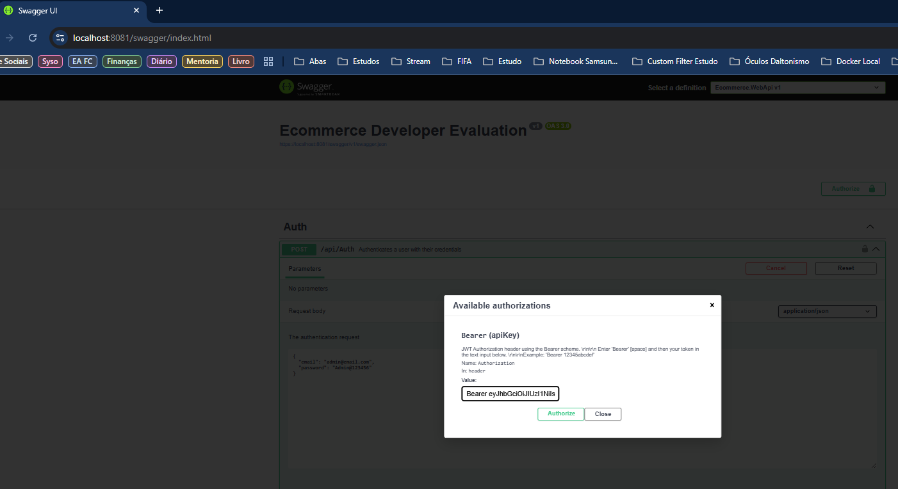
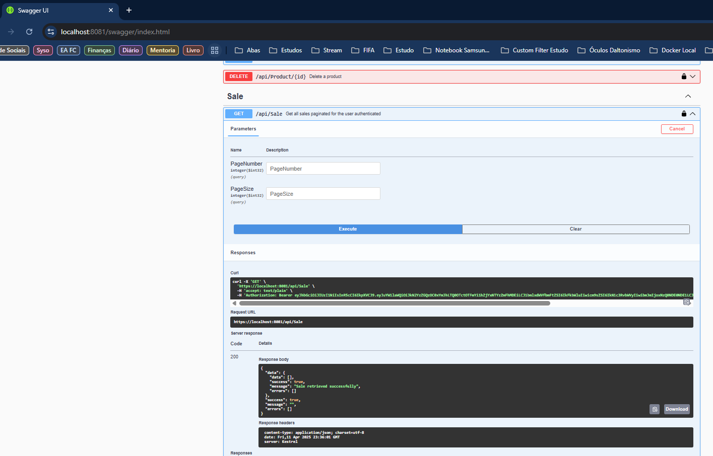
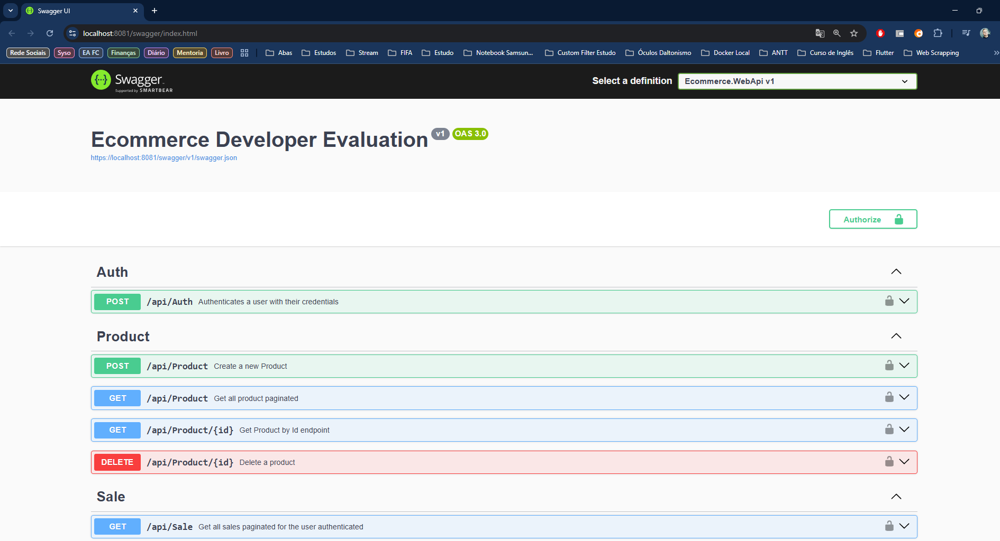
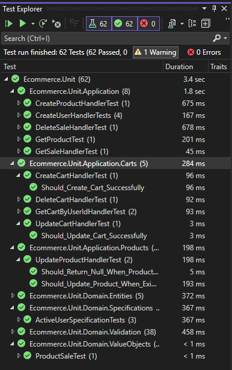

# EcommerceEvaluation API

This project provides a RESTful API built with ASP.NET Core (.NET 8), using PostgreSQL and Docker for backend infrastructure. It implements authentication via JWT and follows a clean architecture with DDD principles.

---

## 🛠️ Setup

Before running, ensure the project builds correctly:

```bash
dotnet clean
dotnet build
```

Then run the full environment with Docker:


To run the application:

```bash
docker-compose up --build
```

API will be available at:

```
https://localhost:8081/swagger
```

---

## 👤 Creating a User

Use the following cURL command to create your first user:

```bash
curl -X 'POST' \
  'https://localhost:8081/api/Users' \
  -H 'accept: text/plain' \
  -H 'Content-Type: application/json' \
  -d '{
  "username": "Admin",
  "password": "Admin@123456",
  "phone": "11983564032",
  "email": "admin@email.com",
  "status": 1,
  "role": 1
}'
```

---

## 🔐 Authenticate

After creating the user, obtain a JWT token via:

```bash
curl -X 'POST' \
  'https://localhost:8081/api/Auth' \
  -H 'accept: text/plain' \
  -H 'Content-Type: application/json' \
  -d '{
  "email": "admin@email.com",
  "password": "Admin@123456"
}'
```

### ✅ Response Example

```json
{
  "data": {
    "data": {
      "token": "eyJhbGciOiJIUzI1NiIsInR5cCI6IkpXVCJ9...",
      "email": "admin@email.com",
      "name": "Admin",
      "role": "Customer"
    },
    "success": true,
    "message": "User authenticated successfully",
    "errors": []
  },
  "success": true,
  "message": "",
  "errors": []
}
```

---

## 🔓 Use the Token

After authenticating, you can call protected endpoints. In Swagger, use **"Authorize"** at the top and insert:

```
Bearer <your_token>
```

Or via cURL, access protected resources:

```bash
curl -X 'GET' \
  'https://localhost:8081/api/Sale' \
  -H 'accept: text/plain' \
  -H 'Authorization: Bearer <your_token>'
```

---

## 📦 Tech Stack

- ASP.NET Core 8
- PostgreSQL
- Docker
- MediatR
- AutoMapper
- FluentValidation
- JWT Authentication
- DDD + Clean Architecture

---

## 🧪 Tips

- Always create a user before authenticating.
- Use Swagger to explore all endpoints visually.
- JWT is required for most protected endpoints.

---

MIT License


---

---

## 📸 Evidence

Below are screenshots confirming complete execution and validation of the system:

### ✅ 1. Docker Compose Running


### 🧩 2. Database Diagram


### ➕ 3. Create User


### 🔐 4. Authenticate User


### 📥 5. Validate Token


### 🧪 6. Add Bearer Token to Swagger Authorize


### 📦 7. Get Sale With Token


### 🔄 8. Swagger Interface Active


### ✅ 9. Unit Tests Successful



---

## 📸 Evidence

The following screenshots demonstrate the application running successfully:

### ✅ 1. Docker Compose Running


### 🧩 2. Database Diagram


### 🖥️ 3. Swagger Running


### ✍️ 4. Creating a User via Swagger


### 🔐 5. Authenticating a User


### 🛂 6. Validating Token Response


### 🪪 7. Adding Token to Swagger Authorize


### 📥 8. Getting Sales with Token


### ✅ 9. Test Explorer - All Tests Passing

